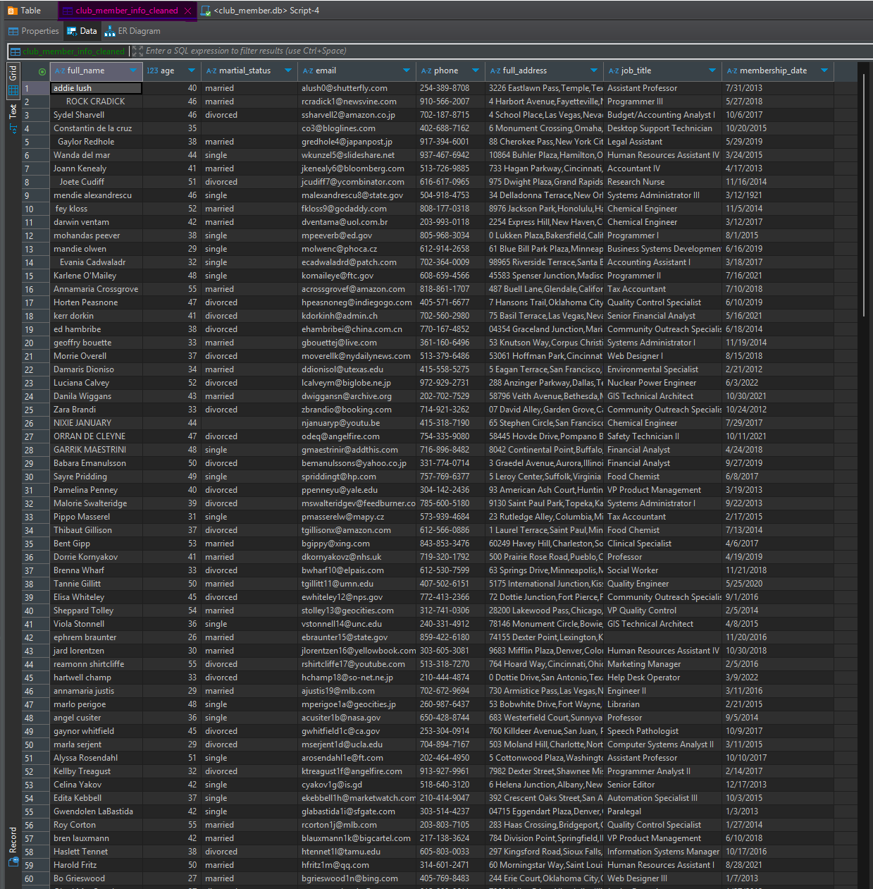

# Data Introduction
This is an educational project on data cleaning and preparation using SQL. The original database in CSV format is located in the file club_member_info.csv. Here, we will explore the steps that need to be applied to obtain a cleansed version of the dataset.

**Today we will going to step by step cleaning dataset**

# STEP 1:

## 1.1 Take a look at dataset by below query
```SQL
SELECT * FROM club_member_info cmi 
LIMIT 10;
```

## 1.2 This is show what above code run.
|full_name|age|martial_status|email|phone|full_address|job_title|membership_date|
|---------|---|--------------|-----|-----|------------|---------|---------------|
|addie lush|40|married|alush0@shutterfly.com|254-389-8708|3226 Eastlawn Pass,Temple,Texas|Assistant Professor|7/31/2013|
|      ROCK CRADICK|46|married|rcradick1@newsvine.com|910-566-2007|4 Harbort Avenue,Fayetteville,North Carolina|Programmer III|5/27/2018|
|Sydel Sharvell|46|divorced|ssharvell2@amazon.co.jp|702-187-8715|4 School Place,Las Vegas,Nevada|Budget/Accounting Analyst I|10/6/2017|
|Constantin de la cruz|35||co3@bloglines.com|402-688-7162|6 Monument Crossing,Omaha,Nebraska|Desktop Support Technician|10/20/2015|
|  Gaylor Redhole|38|married|gredhole4@japanpost.jp|917-394-6001|88 Cherokee Pass,New York City,New York|Legal Assistant|5/29/2019|
|Wanda del mar       |44|single|wkunzel5@slideshare.net|937-467-6942|10864 Buhler Plaza,Hamilton,Ohio|Human Resources Assistant IV|3/24/2015|
|Joann Kenealy|41|married|jkenealy6@bloomberg.com|513-726-9885|733 Hagan Parkway,Cincinnati,Ohio|Accountant IV|4/17/2013|
|   Joete Cudiff|51|divorced|jcudiff7@ycombinator.com|616-617-0965|975 Dwight Plaza,Grand Rapids,Michigan|Research Nurse|11/16/2014|
|mendie alexandrescu|46|single|malexandrescu8@state.gov|504-918-4753|34 Delladonna Terrace,New Orleans,Louisiana|Systems Administrator III|3/12/1921|
| fey kloss|52|married|fkloss9@godaddy.com|808-177-0318|8976 Jackson Park,Honolulu,Hawaii|Chemical Engineer|11/5/2014|

## 1.3 *We see a lots of problem with dataset like: inconsistency, missing value, date's column is not at same format ..ect...*

## Now we going to resolve all problems we see in next step.

# STEP 2:
## 2.1 We will make a copy to make sure we don't screw up original dataset. (*Always careful!!!*)
```SQL
CREATE TABLE club_member_info_cleaned (
	full_name VARCHAR(50),
	age INTEGER,
	martial_status VARCHAR(50),
	email VARCHAR(50),
	phone VARCHAR(50),
	full_address VARCHAR(50),
	job_title VARCHAR(50),
	membership_date VARCHAR(50)
);
```
 After you run above query to create a blank table but have same format as original table, now all you need to do is transfer all data from original table to blank table

## 2.2 Now we will copy table from original dataset *club_member_info* to backup file *club_member_info_cleaned*
```SQL
INSERT INTO club_member_info_cleaned
SELECT * FROM club_member_info;
 ```

After have a copied file of original table now, we will processing abnormally data
# STEP 3:
### We will go throughtly column to column and resolve all problem.
# 3.1 `full_name` column
-  We'll use `TRIM()` to delete unwanted space between `full_name`
   - If you unsure what your query will be, so run below query to have double check
   ```
    SELECT TRIM(full_name) FROM club_member_info_cleaned cmic;
   ``` 
   after you certainly your query run good then.
   
- We will use `UPDATE SET` to update our query to `club_member_info_cleaned`
   - ```UPDATE club_member_info_cleaned SET full_name = TRIM(full_name) ```
Now you can see all unwanted space have deleted and **REPEAT ONCE AGAIN WHEN YOU USE `UPDATE SET` DATA CAN'T UNDO SO BE CAREFUL CHECKING YOUR QUERY BY `SELECT SYNTAX(cols) FROM your_table` before use `UPDATE SET`, DO THE SAME IN THE FOLLOWING STEPS.**


|full_name|age|martial_status|email|phone|full_address|job_title|membership_date|
|---------|---|--------------|-----|-----|------------|---------|---------------|
|addie lush|40|married|alush0@shutterfly.com|254-389-8708|3226 Eastlawn Pass,Temple,Texas|Assistant Professor|7/31/2013|
|ROCK CRADICK|46|married|rcradick1@newsvine.com|910-566-2007|4 Harbort Avenue,Fayetteville,North Carolina|Programmer III|5/27/2018|
|Sydel Sharvell|46|divorced|ssharvell2@amazon.co.jp|702-187-8715|4 School Place,Las Vegas,Nevada|Budget/Accounting Analyst I|10/6/2017|
|Constantin de la cruz|35||co3@bloglines.com|402-688-7162|6 Monument Crossing,Omaha,Nebraska|Desktop Support Technician|10/20/2015|
|Gaylor Redhole|38|married|gredhole4@japanpost.jp|917-394-6001|88 Cherokee Pass,New York City,New York|Legal Assistant|5/29/2019|
|Wanda del mar|44|single|wkunzel5@slideshare.net|937-467-6942|10864 Buhler Plaza,Hamilton,Ohio|Human Resources Assistant IV|3/24/2015|
|Joann Kenealy|41|married|jkenealy6@bloomberg.com|513-726-9885|733 Hagan Parkway,Cincinnati,Ohio|Accountant IV|4/17/2013|
|Joete Cudiff|51|divorced|jcudiff7@ycombinator.com|616-617-0965|975 Dwight Plaza,Grand Rapids,Michigan|Research Nurse|11/16/2014|
|mendie alexandrescu|46|single|malexandrescu8@state.gov|504-918-4753|34 Delladonna Terrace,New Orleans,Louisiana|Systems Administrator III|3/12/1921|
|fey kloss|52|married|fkloss9@godaddy.com|808-177-0318|8976 Jackson Park,Honolulu,Hawaii|Chemical Engineer|11/5/2014|

- We will use `UPPER` to capitalization `full_name`
``` UPDATE club_member_info_cleaned SET full_name = UPPER(full_name) ```

 |full_name|age|martial_status|email|phone|full_address|job_title|membership_date|
|---------|---|--------------|-----|-----|------------|---------|---------------|
|ADDIE LUSH|40|married|alush0@shutterfly.com|254-389-8708|3226 Eastlawn Pass,Temple,Texas|Assistant Professor|7/31/2013|
|ROCK CRADICK|46|married|rcradick1@newsvine.com|910-566-2007|4 Harbort Avenue,Fayetteville,North Carolina|Programmer III|5/27/2018|
|SYDEL SHARVELL|46|divorced|ssharvell2@amazon.co.jp|702-187-8715|4 School Place,Las Vegas,Nevada|Budget/Accounting Analyst I|10/6/2017|
|CONSTANTIN DE LA CRUZ|35||co3@bloglines.com|402-688-7162|6 Monument Crossing,Omaha,Nebraska|Desktop Support Technician|10/20/2015|
|GAYLOR REDHOLE|38|married|gredhole4@japanpost.jp|917-394-6001|88 Cherokee Pass,New York City,New York|Legal Assistant|5/29/2019|
|WANDA DEL MAR|44|single|wkunzel5@slideshare.net|937-467-6942|10864 Buhler Plaza,Hamilton,Ohio|Human Resources Assistant IV|3/24/2015|
|JOANN KENEALY|41|married|jkenealy6@bloomberg.com|513-726-9885|733 Hagan Parkway,Cincinnati,Ohio|Accountant IV|4/17/2013|
|JOETE CUDIFF|51|divorced|jcudiff7@ycombinator.com|616-617-0965|975 Dwight Plaza,Grand Rapids,Michigan|Research Nurse|11/16/2014|
|MENDIE ALEXANDRESCU|46|single|malexandrescu8@state.gov|504-918-4753|34 Delladonna Terrace,New Orleans,Louisiana|Systems Administrator III|3/12/1921|
|FEY KLOSS|52|married|fkloss9@godaddy.com|808-177-0318|8976 Jackson Park,Honolulu,Hawaii|Chemical Engineer|11/5/2014|

- We will use `LIKE` to delete all `???` in `full_name`
```SQL
UPDATE club_member_info_cleaned SET full_name = '' WHERE full_name LIKE '%???%'
```
- We will use `UPPER` to capitalization all `full_name`
```SQL
UPDATE club_member_info_cleaned SET full_name = UPPER(full_name)
``` 

# 3.2 `age` column.
 - I will use `SELECT age FROM club_member_info_cleaned cmic WHERE age < 18 OR age > 90;` to check outlier
 - And i will write `SELECT SUBSTR(age, LENGTH(age) - 1) FROM club_member_info_cleaned cmic` to delete mis-typo
 - Next i will write `SELECT * 	FROM club_member_info_cleaned cmic WHERE age = '';` to checking NULL value.
 - 
|full_name|age|martial_status|email|phone|full_address|job_title|membership_date|
|---------|---|--------------|-----|-----|------------|---------|---------------|
|LEONORE BOOTHJARVIS||married|lboothjarvisi2@bloglines.com|713-618-0516|33110 Luster Plaza,Houston,Texas|Sales Representative|6/13/2022|
|CHERY BATISSE||divorced|cbatissen3@bandcamp.com|804-431-7226|604 Elgar Way,Richmond,Virginia|VP Product Management|7/30/2012|
|VIRGINA HUBBOCK||single|vhubbockep@ed.gov|540-535-0069|7 Schmedeman Center,Roanoke,Virginia|Media Manager I|7/6/2021|

- I will query to fill `NULL` in missing value by `UPDATE club_member_info_cleaned SET age = NULL WHERE age = ''`

# 3.3 `martial_status` column.
- I will query `SELECT DISTINCT martial_status FROM club_member_info_cleaned cmic` to check unique value.
  
|martial_status|
|--------------|
|married|
|divorced|
|        |
|single|
|divored|

- i will query `UPDATE club_member_info_cleaned SET martial_status = 'divorced' WHERE martial status = 'divored';` to fix mis-typo
- i will query `UPDATE club_member_info_cleaned SET martial_status = 'unknow' WHERE martial status = ' ';`
- After run query
  

|martial_status|
|--------------|
|married|
|divorced|
|unknow|
|single|


That all we column we need to resolve.